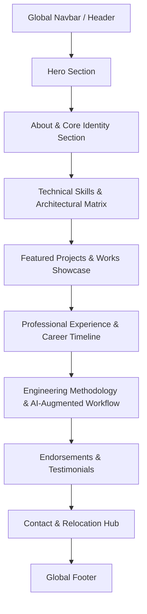

# Portfolio Project Plan: Safvan Khalifa (`safvan-dev`)

## 1. High-Level Project Overview

### 1.1 Goal of the Portfolio
The primary goal of this portfolio is to establish an authoritative, high-impact digital presence for **Safvan Khalifa**—a Full Stack Web Developer and Systems Craftsman with 3+ years of professional commercial experience.

A central strategic objective is positioning Safvan for an upcoming **early-2027 international relocation to the Boston suburbs, Massachusetts, USA**, presenting him to US and global tech companies as a versatile, high-velocity engineer who combines:
1. **Handcrafted Native Engineering Core**: Deep, unassisted production mastery of the **MERN Stack** (MongoDB, Express.js, React, Node.js), modern JavaScript/TypeScript, relational/non-relational database optimization, RESTful API architecture, and scalable full-stack web applications.
2. **AI-Augmented Systems & Applied Tooling**: A forward-thinking, power-user capability to leverage cutting-edge AI tools (local LLMs via LM Studio/Ollama, OpenClaw, Antigravity, and Claude/Gemini) to architect, test, and ship complex software across foreign ecosystems—including low-level Rust (bare-metal UEFI), Android (Kotlin Jetpack Compose), Linux desktop environments (C++/Qt 6/QML, Bash orchestration, Systemd, Wayland), and media desktop clients (CastLabs Electron/DRM).

### 1.2 Target Audience
* **Technical Hiring Managers & Engineering Directors**: Looking for dependable senior/mid-level Full Stack engineers who possess solid fundamental engineering intuition, write clean code, optimize database queries, and deliver robust SPAs and APIs.
* **Tech Startup Founders & CTOs**: Seeking high-leverage "10x" generalists who can build core web products natively while utilizing autonomous AI tooling to rapidly prototype and manage ancillary systems, mobile apps, and developer infrastructure.
* **Technical Recruiters (US & Global Tech Hubs)**: Reviewing candidate portfolios for Boston-area and remote US engineering roles, requiring clear signals of experience, verifiable metrics, clean Git habits, and endorsements.
* **Open-Source Collaborators & Engineering Peers**: Developers in the Linux, Android, and web communities looking for project architecture guides, technical rigor, and open-source contributions.

### 1.3 Tone and Voice
* **Artisanal yet Technical**: Grounded, professional, and confident without hollow buzzwords. Communicates deep respect for clean architecture, software craftsmanship, and performance benchmarks.
* **Honest & Transparent**: Clearly delineates between core handcrafted domains (MERN) and AI-augmented cross-platform explorations (Rust, Android, Qt).
* **Direct & Metric-Driven**: Emphasizes concrete outcomes (e.g., *handling 500+ concurrent requests*, *45% database query latency reduction*, *advanced route/pricing tools*, *60 FPS Jetpack Compose rendering*, *20+ automated test suites*, *180MB dependency bloat eliminated*).
* **Human & Approachable**: Balances technical discipline with personality—reflecting a passion for fitness, culinary precision, and open-source culture.

---

## 2. Tech Stack Decision & Evaluation

### 2.1 Evaluated Options

| Criteria | Option A: React 19 + Vite 7 + GSAP 3 + Lenis (Current Foundation) | Option B: Next.js 15 (App Router) + Tailwind CSS + Framer Motion |
| :--- | :--- | :--- |
| **Current State** | Existing codebase already bootstrapped in `safvan-dev` with React 19.1, Vite 7.3, GSAP 3.13, and Lenis 1.2. | Would require a complete rewrite/migration from scratch. |
| **Animation Fidelity** | Superior timeline control, scroll pinning, horizontal section scrubbing, and physics-based cursor interactions via GSAP and Lenis. | Framer Motion is declarative and robust, but horizontal multi-panel pinning and scrub timelines require more boilerplate. |
| **Performance & DX** | Instant Vite HMR, zero server runtime overhead, static client-side bundle deployable directly to Netlify/Vercel/GitHub Pages with zero cold starts. | Server-side rendering (SSR) benefits SEO, but adds serverless runtime complexity and edge function cold starts for a single-page portfolio. |
| **Design Consistency** | Existing `theme.css` tokens and SASS/BEM architecture already provide fine-grained styling controls. | Would require translating the existing CSS variable architecture into Tailwind utility configurations. |
| **Maintenance Burden** | Minimal. Self-contained, lightweight bundle with pinned dependencies. | Frequent Next.js canary/major updates and App Router conventions can cause build churn. |

### 2.2 Selected Decision: **Option A (React 19 + Vite 7 + GSAP 3 + Lenis)**

#### Rationale:
1. **Preserves Existing Momentum**: The `safvan-dev` repository already features a working Vite 7 and React 19 setup with GSAP and Lenis configured. Continuing with this stack minimizes churn and focuses 100% of effort on content fidelity, layout architecture, and responsiveness.
2. **Exhibits Native Frontend Capabilities**: Building an interactive, scroll-driven portfolio in React 19 demonstrates Safvan's unassisted mastery of frontend lifecycle patterns, custom hooks, and high-performance DOM manipulation.
3. **Smooth Storytelling**: GSAP ScrollTrigger and Lenis smooth scrolling allow for horizontal work showcases and staggered reveals that elevate the perceived quality of the engineering work.

---

## 3. Site Map & Information Architecture

The portfolio is structured as a high-performance **Single-Page Application (SPA)** with smooth anchor navigation, backed by modular sub-views / modal detail drawers:

### Page Sections Breakdown:
1. **Header / Navbar**: Minimalist floating navigation with active section indicator, resume download link, and theme toggle / terminal drawer trigger.
2. **Hero Section (`HeroSection`)**: Strong visual hook, name, core title (*Full Stack Web Developer & Systems Craftsman*), punchy tagline, primary CTA (*Get in Touch* / *View Work*), and interactive 8-bit developer avatar art.
3. **About / Identity Section (`AboutSection`)**: Narrative bio explaining Safvan's background, 3+ years of professional full-stack development, upcoming late-2026 Boston relocation, personal engineering ethos, and balance of discipline (fitness, culinary precision).
4. **Skills & Capabilities Matrix (`SkillsMatrixSection`)**: Two-tier technical matrix:
   - *Tier 1: Native Handcrafted Mastery* (React.js, Next.js, Node.js, Express.js, REST APIs, MongoDB, SQL [MySQL, PostgreSQL], Schema Design, Query Performance Tuning, Debugging & Code Rectification).
   - *Tier 2: AI-Augmented Systems & Applied Tooling* (Rust bare-metal UEFI, Android Kotlin Compose, C++/Qt 6/QML, Arch/CachyOS Shell orchestration, Local LLM agents via OpenClaw/LM Studio).
5. **Featured Projects Showcase (`WorksSection`)**: Interactive project cards with category filters:
   - *MERN & Web Core*: Cloud-Hosted Multi-Modal AI Agents Platform, Transportation Management Platform (handling 500+ concurrent requests, -45% DB latency), Large-Scale Custom E-Commerce Platform, InnerCircle P2P Marketplace.
   - *AI-Augmented Systems*: Crispyroll (Linux HTPC Electron Media Client), Fukurō (Android Compose Comic Reader), Talaria Bootloader (Rust bare-metal UEFI), MyCosmicRice (Dynamic Matugen theming pipeline).
6. **Experience & Education Timeline (`ExperienceSection`)**: Detailed chronological work history & verified credentials:
   - Web Developer | MarketingSolver.in, Navsari (Aug '24 – Aug '25)
   - Software Developer | La Net Team, Surat (Jul '22 – Jul '24)
   - Software Developer Trainee | La Net Team, Surat (Jan '22 – Jul '22)
   - Education: Computer Engineering | GDEC, Abrama (CGPA: 7.84, Jul '18 – Jul '22)
7. **Engineering Methodology & AI-Augmented Workflow (`MethodologySection`)**: Explains *how* Safvan works: strict verification suites, TDD/QA discipline, memory leak audits, and leveraging autonomous AI tooling as a force multiplier for cross-domain engineering.
8. **Endorsements & Testimonials (`TestimonialsSection`)**: Verified quotes and LinkedIn links from manager Damini Choat, coworker Abhishek Jariwala, and coworker Shrey Jariwala.
9. **Contact & Relocation Hub (`ContactSection`)**: Clean inquiry form, direct email (`khalifasafvan@yahoo.com`), phone (`+91 8153837262`), location availability, GitHub (`khSafvan`), and verified personal LinkedIn (`https://www.linkedin.com/in/khalifasafvan`).
10. **Footer (`Footer`)**: Copyright, tech stack credits (Built with React 19, Vite, GSAP), and quick links.

---

## 4. Build Milestones & Implementation Order

* **Milestone 1: Planning & Data Alignment (Current Phase)**
  * Finalize `plan.md`, `content.md`, `layout.md`, `sections.md`, `design.md`, and `todo.md`.
  * Ensure clear distinction between MERN core and AI-augmented systems projects.
* **Milestone 2: Configuration & Content Consolidation**
  * Update `src/config/portfolio.js` with complete, verified project data, skills taxonomy, and relocation notes.
  * Audit and standardize design tokens in `src/styles/theme.css`.
* **Milestone 3: Core Section Restructuring & Layout**
  * Refactor `HeroSection`, `AboutSection`, `SkillsMatrixSection`, and `WorksSection`.
  * Implement filtering/toggle mechanism for *MERN Core* vs. *AI-Augmented Systems* projects.
* **Milestone 4: Interactive Polish & Animations**
  * Refine GSAP ScrollTrigger timelines, staggered reveals, and Lenis smooth scrolling.
  * Optimize cursor hover states and mobile touch alternatives.
* **Milestone 5: Verification, Responsive Audits & Performance**
  * Test responsiveness across 320px (mobile) to 2560px (ultrawide).
  * Run Lighthouse performance, accessibility, best practices, and SEO audits.
  * Validate that no private secrets, unverified metrics, or API keys are exposed.
* **Milestone 6: Deployment & Production Readiness**
  * Build production assets via `npm run build`.
  * Validate production preview on Netlify (`khalifasafvan.netlify.app`).
* **Milestone 7: Flat Design, Typography Overhaul & Content-Cutting Pass (Completed)**
  * **Spacing & Shape Standardization**: Unified 4/8px base spacing scale and 4px subtle radius. Removed hover-dependent layout shifts in favor of static, always-visible architectural design.
  * **Option B Typography Implementation**: Installed `@fontsource-variable/fraunces` (warm, high-character serif headings), `@fontsource-variable/plus-jakarta-sans` (crisp body geometric sans), and `@fontsource-variable/jetbrains-mono` (technical mono stamps/tags). Zero external Google Font dependencies.
  * **Rigorous Content-Cutting Pass**: Cut 30–50% copy volume across all sections (Hero, Bio/About, Projects Showcase, Skills Matrix, Experience, Methodology, Testimonials, and Contact). Eliminated boastful words and filler narratives in favor of plain, confident technical facts and verified metrics.

---

## 5. Open Questions & Assumptions Flagged

### Assumptions Made
1. **Positioning Strategy**: We assume Safvan wants to be framed transparently: an expert Full Stack MERN engineer natively, and an AI-augmented generalist who uses AI tools to build across Rust, Android, Qt, and Linux. This turns a potential ambiguity into a massive competitive advantage.
2. **Single-Page Architecture**: We assume a polished, continuous-scroll SPA with anchor links is preferred over multi-page navigation for developer portfolios, ensuring high retention and immediate access to projects.
3. **Boston Relocation Timeline**: Target relocation date is strictly **Early 2027** for the Boston suburbs, MA area, emphasizing readiness for US timezones and hybrid/remote roles in Massachusetts.
4. **Design Palette**: The warm, editorial Earth-Toned Terracotta & Sage palette currently in `src/styles/theme.css` is the primary visual brand.

### Flagged Gaps (Information Needed)
1. `[TODO: need live URL or public repository for E-Commerce Platform]`: Specify whether this project is in active development, proprietary client code, or has a public demo link.
2. `[TODO: need live URL or case study link for B2B SaaS Transportation Platform]`: Provide sanitized screenshots or architecture diagrams if client NDA permits.
3. `[TODO: need live URL or demo link for InnerCircle Marketplace]`: Confirm if deployed or archived.
4. `[TODO: need official resume PDF path]`: Confirm location and naming of the downloadable resume file in `/public`.
5. `[TODO: need high-res project preview images]`: Ensure screenshots for web and systems projects exist in `/public/projects/`.
