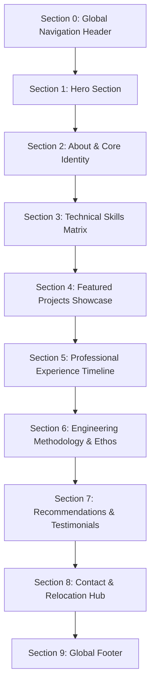

# Section-by-Section Specification: Safvan Khalifa (`safvan-dev`)

This document defines the top-to-bottom sequence of sections for Safvan Khalifa's portfolio, their strategic purpose, exact content mappings from `content.md`, and specific interactive/animation behaviors.

---

## Top-to-Bottom Execution Order

---

## 1. Global Navigation Header (`Header`)
* **Component**: `src/components/layout/Header/Header.jsx`
* **Purpose**: Provide persistent, low-friction access to all major sections, resume download, and visual brand identity.
* **Content Source**: `content.md` -> Section 1: Global Navigation (`Navbar`).
* **Special Behaviors & Interactions**:
  * **Translucent Blur**: Uses `backdrop-filter: blur(12px)` and subtle bottom border (`var(--color-border)`).
  * **Scroll Spy**: Automatically updates active link indicator based on the current visible section via `IntersectionObserver` or GSAP ScrollTrigger.
  * **Mobile Drawer**: On screens `< 768px`, navigation collapses into a smooth slide-out hamburger menu with spring physics.
  * **Resume CTA**: Direct download trigger for the sanitized resume PDF.

---

## 2. Hero Section (`HeroSection`)
* **Component**: `src/sections/HeroSection/HeroSection.jsx`
* **Purpose**: Capture immediate visitor attention within 3 seconds, deliver the core value proposition, clearly communicate the MERN native craft + AI-augmented systems dual strength, and establish the Boston relocation timeline.
* **Content Source**: `content.md` -> Section 2: Hero Section (`HeroSection`).
* **Special Behaviors & Interactions**:
  * **Staggered Text Entrance**: GSAP timeline triggers on page load, staggering the entrance of the greeting (`y: 20 -> 0, opacity: 0 -> 1`), name, title, and tagline with an ease of `power3.out`.
  * **8-Bit Avatar Interaction**: The `/dev8bitArt.png` asset features a subtle floating/bobbing CSS keyframe animation (`translateY(-6px)` to `translateY(6px)`) and a terminal status chip (`zack@ghost:~$`).
  * **Hover Glow on CTAs**: Primary button (`Explore My Work`) features a subtle lift (`translateY(-2px)`) and scale animation on hover with magnetic cursor affinity.

---

## 3. About & Core Identity Section (`AboutSection`)
* **Component**: `src/sections/AboutSection/AboutSection.jsx`
* **Purpose**: Provide biographical depth, establish 3+ years of commercial credibility, highlight the unassisted MERN foundation, explain the AI-augmented philosophy, and showcase personal discipline (bodybuilding, culinary craft).
* **Content Source**: `content.md` -> Section 3: About & Core Identity Section (`AboutSection`).
* **Special Behaviors & Interactions**:
  * **Scroll-Triggered Reveal**: The section text fades and slides up as it enters the viewport (`start: "top 80%"`).
  * **Quick Stats Spotlight Card**: Right column features an interactive card highlighting key milestones (Degree, Years of Experience, Current Location -> Boston Target, Hobbies) with subtle hover tilt physics.
  * **Editorial Typography Rhythm**: Large serif quotes for accents paired with clean sans-serif body text for readability.

---

## 4. Technical Skills Matrix (`SkillsMatrixSection`)
* **Component**: `src/sections/SkillsMatrixSection/SkillsMatrixSection.jsx`
* **Purpose**: Transparently delineate between **Native Handcrafted Mastery** (Frontend, Backend, Databases, Schema Optimization, Error Handling) and **AI-Augmented Systems** (Rust, Android Compose, Qt/QML, Bash, Local LLMs), demonstrating high technical self-awareness.
* **Content Source**: `content.md` -> Section 4: Technical Skills Matrix (`SkillsMatrixSection`).
* **Special Behaviors & Interactions**:
  * **Comparative Dual-Panel Grid**: Desktop renders a two-column grid. Left panel highlights *Native Handcrafted Core* with earthy Sage Green badges grouped into Frontend, Backend, Databases (MySQL, PostgreSQL, MongoDB), Schema Optimization, and Error Handling; Right panel highlights *AI-Augmented Systems & Applied Tooling* with dark terminal/system badges.
  * **Badge Stagger Animation**: When scrolled into view, skill pills stagger into place with a subtle spring bounce.
  * **Interactive Tooltips**: Hovering over complex items (e.g., *MySQL Stored Procedures* or *500+ Concurrent Requests*) displays a short 1-sentence note explaining where Safvan applied that skill in production.

---

## 5. Featured Projects Showcase (`WorksSection`)
* **Component**: `src/sections/WorksSection/WorksSection.jsx`
* **Purpose**: Showcase concrete, high-impact software engineering projects across both web and systems domains with verifiable metrics, architecture notes, and code links.
* **Content Source**: `content.md` -> Section 5: Featured Projects Showcase (`WorksSection`).
* **Special Behaviors & Interactions**:
  * **Interactive Category Filtering**: Filter bar allows toggling between:
    * `All Projects`
    * `★ Native MERN & Full-Stack Web` (Cloud-Hosted Multi-Modal AI Agents Platform, Transportation Management Platform, Large-Scale E-Commerce Platform, InnerCircle, ICB Nur Foundation)
    * `⚙ AI-Augmented Systems & Tools` (Crispyroll, Fukurō, Talaria Bootloader, MyCosmicRice)
  * **Animated Re-layout**: Card transitions re-animate smoothly when filters switch (using GSAP `Flip` plugin or CSS opacity/transform transitions).
  * **Metrics Badges**: Each card displays a high-visibility metric badge (e.g., `500+ Concurrent Requests`, `-45% DB Latency`, `60 FPS Verified`, `20+ Unit Tests`, `Zero OS Dependencies`).
  * **Hover Zoom & Cursor State**: Hovering over a project card expands the image container slightly and triggers a custom cursor label (`View Project`).

---

## 6. Professional Experience Timeline (`ExperienceSection`)
* **Component**: `src/sections/ExperienceSection/ExperienceSection.jsx`
* **Purpose**: Detail formal commercial employment history, demonstrating continuous career progression from Trainee to Software Developer to Web Developer, along with verified academic credentials.
* **Content Source**: `content.md` -> Section 6: Professional Work History (`ExperienceSection`) and Section 7: Education & Credentials.
* **Special Behaviors & Interactions**:
  * **Connected Node Timeline**: A vertical track runs down the section with glowing circular nodes corresponding to each position:
    * Web Developer | MarketingSolver.in, Navsari (Aug '24 – Aug '25)
    * Software Developer | La Net Team, Surat (Jul '22 – Jul '24)
    * Software Developer Trainee | La Net Team, Surat (Jan '22 – Jul '22)
    * Academic Degree: GDEC, Abrama (Computer Engineering, CGPA: 7.84, Jul '18 – Jul '22)
  * **Scroll-Triggered Progress**: As the user scrolls, a colored fill advances down the vertical timeline line using GSAP ScrollTrigger.
  * **Expandable Details**: Each role contains an expandable list of technical achievements, client impact metrics, and technology chips.

---

## 7. Engineering Methodology & AI-Augmented Workflow (`MethodologySection`)
* **Component**: `src/sections/MethodologySection/MethodologySection.jsx`
* **Purpose**: Educate hiring managers on *how* Safvan operates—his uncompromising definition of "done" (automated tests, hardware verification, clean docs), his native craftsmanship in web, and how he leverages AI agents as a force multiplier.
* **Content Source**: `content.md` -> Section 9: Engineering Methodology & AI-Augmented Workflow (`MethodologySection`).
* **Special Behaviors & Interactions**:
  * **Three Pillars Grid**: Displays three elevated cards:
    1. *The Definition of "Done"* (Verification suites, 0 dropped frames, zero-leak documentation).
    2. *Native Craftsmanship for Web* (Unassisted MERN, raw SQL optimizations, deep DOM control).
    3. *AI-Augmented Force Multiplier* (Local LLMs, OpenClaw, token-efficient workflows like `/stingycoder`).
  * **Hover Accent Highlights**: Cards subtly shift border colors on hover, reinforcing the rigorous engineering mindset.

---

## 8. Recommendations & Testimonials (`TestimonialsSection`)
* **Component**: `src/sections/TestimonialsSection/TestimonialsSection.jsx`
* **Purpose**: Provide third-party social proof from managers and peers validating Safvan's work ethic, technical skills, and collaboration.
* **Content Source**: `content.md` -> Section 8: Testimonials & Recommendations (`TestimonialsSection`).
* **Special Behaviors & Interactions**:
  * **Carousel / Grid Layout**: On desktop, renders as a high-readability 3-card grid or smooth drag/swipe carousel; on mobile, stacks into swipeable testimonial cards.
  * **Verified LinkedIn Badges**: Each recommendation includes a clickable badge linking directly to the recommender's LinkedIn profile.
  * **Editorial Quotation Marks**: Large stylized quotation marks in `var(--color-primary-light)` accentuating the managerial praise.

---

## 9. Contact & Relocation Hub (`ContactSection`)
* **Component**: `src/sections/ContactSection/ContactSection.jsx`
* **Purpose**: Convert visitors into direct conversations, inquiries, and interview invitations ahead of the late-2026 Boston relocation.
* **Content Source**: `content.md` -> Section 10: Contact & Relocation Hub (`ContactSection`).
* **Special Behaviors & Interactions**:
  * **Dual-Column Architecture**:
    * Left: Direct pitch, Boston relocation countdown / announcement, direct email (`khalifasafvan@yahoo.com`), phone number (`+91 8153837262`), GitHub (`khSafvan`), and verified LinkedIn (`https://www.linkedin.com/in/khalifasafvan`).
    * Right: Interactive contact inquiry form (Name, Email, Subject, Message).
  * **Client-Side Form Validation**: Real-time feedback for email format and required fields; accessible error states.
  * **Copy-to-Clipboard Micro-Interaction**: Clicking on the email address copies it to the clipboard with an instant tooltip confirmation (`Copied to clipboard!`).

---

## 10. Global Footer (`Footer`)
* **Component**: `src/components/layout/Footer/Footer.jsx`
* **Purpose**: Sign off with clean colophon, copyright notice, and developer easter egg.
* **Content Source**: `content.md` -> Section 11: Global Footer (`Footer`).
* **Special Behaviors & Interactions**:
  * **Terminal Easter Egg**: Displays a monospace terminal footer bar: `Host: ghost | System: Ryoku Dev (Arch Linux / CachyOS) | Shell: fish`.
  * **Back to Top Smooth Scroll**: Subtle arrow button that smoothly triggers Lenis scroll back to `#hero`.
